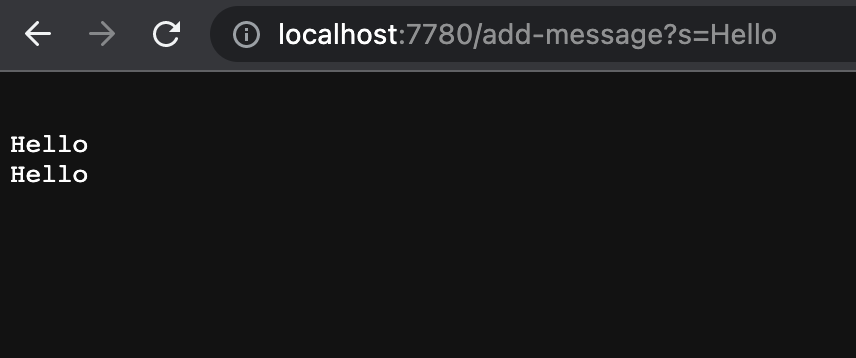
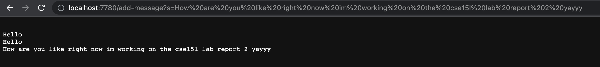
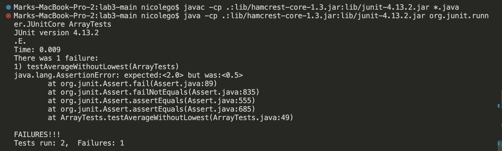

# Lab Report 2: Servers and Bugs
---
## Part 1
This is the code for StringServer.java, which holds is a web server StringServer that concatenates a new line and the string after `=` to the current string. It should return the entire string thus far:

```
import java.io.IOException;
import java.net.URI;

class Handler implements URLHandler {
    String newLineString = "";

    public String handleRequest(URI url) {
        if (url.getPath().equals("/")) {
            return newLineString;
        }
        else if (url.getPath().equals("/add-message")) {
            String[] parameters = url.getQuery().split("=");
            if (parameters[0].equals("s")) {
                newLineString = newLineString.concat("\n" + parameters[1]);
                return newLineString;
            }
        }
        return "404 Not Found!";
    }
}

class StringServer {
    public static void main(String[] args) throws IOException {
        if (args.length == 0) {
            System.out.println("Missing port number! Try any number between 1024 to 49151");
            return;
        }
        int port = Integer.parseInt(args[0]);

        Server.start(port, new Handler());
    }
}
```

> It should also be noted that there is another file running alongside `StringServer.java`, which is `Server.java`, which is for all servers so that the server can be launched.


```
import java.io.IOException;
import java.io.OutputStream;
import java.net.InetSocketAddress;
import java.net.URI;

import com.sun.net.httpserver.HttpExchange;
import com.sun.net.httpserver.HttpHandler;
import com.sun.net.httpserver.HttpServer;

interface URLHandler {
    String handleRequest(URI url);
}

class ServerHttpHandler implements HttpHandler {
    URLHandler handler;
    ServerHttpHandler(URLHandler handler) {
      this.handler = handler;
    }
    public void handle(final HttpExchange exchange) throws IOException {
        // form return body after being handled by program
        try {
            String ret = handler.handleRequest(exchange.getRequestURI());
            // form the return string and write it on the browser
            exchange.sendResponseHeaders(200, ret.getBytes().length);
            OutputStream os = exchange.getResponseBody();
            os.write(ret.getBytes());
            os.close();
        } catch(Exception e) {
            String response = e.toString();
            exchange.sendResponseHeaders(500, response.getBytes().length);
            OutputStream os = exchange.getResponseBody();
            os.write(response.getBytes());
            os.close();
        }
    }
}

public class Server {
    public static void start(int port, URLHandler handler) throws IOException {
        HttpServer server = HttpServer.create(new InetSocketAddress(port), 0);

        //create request entrypoint
        server.createContext("/", new ServerHttpHandler(handler));

        //start the server
        server.start();
        System.out.println("Server Started! Visit http://localhost:" + port + " to visit.");
    }
}
```


This is an example of the output on the server using `/add-message` where `/add-message?s=Hello` runs twice. 
This shows how it keeps the old String and keeps adding new lines even if it's the same string that's being added on:



**What methods are called in my code?**
Both `handleRequest` and the 'main' method in the `StringServer` class were used for the first screenshot. The `handleRequest(URI url)` method actually deals with the query and determines what to do based on the query. For instance, here it printed "Hello" twice because `/add-message?s=Hello` was added to the end of the server URL twice. The `main` method was just what was used to start the server in the first place so it took in the port number as an argument in order to open the server.  

**What are the relevant arguments in these methods, and the values of any relevant fields of the class?**
The argument of `handleRequest` was The URL with the "Hello" query `http://localhost:7780/add-message?s=hello`. The field `newLineString` started off empty because it had no String value to add yet. However, it gets updated with more Strings in order to build off of previously inutted Strings. The argument for the `main` method of StringServer was whatever argument I put in for the port number, which could have been anythign but I chose 7780. 

**How do the values of any relevant fields of the class change from this specific request? If no values got changed, explain why.**
Changing the argument of `handleRequest` would change he whole url, meaning that the url could be wrong so it couldn't run and wouldn't change anything on the server. If only the query was changed so that it took a different word to replace the "Hello" part, then it would simply update the new line with a different String. However, if the `newLineString` field was anything different then the website would've already started with a line of a String that would be added on to (instead of just a blank space). Changing the `main` method argument of the StringServer class on the command line would simply change the port number so the server would still run, just a different port. However, here will be an "Already in use" error if a port number that's inputted is already taken by somebody else on a remote server. 


This next example is the output of ther server adding the phrase "How are you like right now im working on the cse15l lab report 2 yayyy" on to the previous example through the `/add-message?s=How are you like right now im working on the cse15l lab report 2 yayyy`.
This demonstrates how another different String can be added on to the next line through a different query:



**What methods are called in my code?**
Only the `handleRequest` method was used  for the first screenshot because the port number was already chosen and the server is already chosen so the `main` method in the StringServer class doesn't need to be called again. Once again, the `handleRequest` method actually deals with the query and determines what to do based on the query. It's different here because it printed "How are you like right now im working on the cse15l lab report 2 yayyy" because `/add-message?s=How are you like right now im working on the cse15l lab report 2 yayyy` was added after the server URL.
This demonstrates how another different String can be added on to the next line through a different query: 

**What are the relevant arguments in these methods, and the values of any relevant fields of the class?**
The argument of `handleRequest` was The URL with the "How are you like right now im working on the cse15l lab report 2 yayyy" query `http://localhost:7780/add-message?s=How are you like right now im working on the cse15l lab report 2 yayyy`. The field `newLineString` started off empty because it had no String value to add yet. However, it gets updated with more Strings in order to build off of previously inutted Strings.

**How do the values of any relevant fields of the class change from this specific request? If no values got changed, explain why.**
Changing the argument of `handleRequest(URI url)` would change he whole url, meaning that the url could be wrong so it couldn't run and wouldn't change anything on the server. If only the query was changed so that it took a different word to replace the "How are you like right now im working on the cse15l lab report 2 yayyy" part, then it would simply update the new line with a different String. However, if the `newLineString` field was anything different then the website would've already started with a line of a String that would be added on to (instead of just a blank space). 

---
## Part 2
The bug from lab 3 that I will be choosing will be `averageWithoutLowest`, which takes in a double array and averages the numbers but excludes the lower number when calculating that mean. It is meant to return 0 if there are no elements in the array or there is only 1 element in the array.

The following is failure-inducing input that triggers a bug in the program formatting as a JUnit test.
This shows a double array that has duplicates lowest values in it. It's supposed to exclude all of these duplicates but the bug is that it only excludes one of these lowest values, causing the mean to be wrong (because the mean would be higher and it would divide by a higher number since it counts more nuumbers):
```
@Test
public void testAverageWithoutLowest() {
  double[] input1 = {1.0, 1.0, 1.0, 1.0, 2.0};
  assertEquals(2.0, ArrayExamples.averageWithoutLowest(input1), 0.0);
}
```
> It should be noted that `double assertEquals()` test require a third argument, which is `double` delta and it's your desired difference between the first two arguments. If you want to check if they're equal, then the `double delta` value should be `0.0`


However, the following is an input that doesn't induce failure. 
It tests a double array where there are absolutely no duplicates, which wouldn't trigger any bugs:
```
@Test
public void testAverageWithoutLowest2() {
  double[] input2 = {1.0, 2.0, 3.0};
  assertEquals(2.5, ArrayExamples.averageWithoutLowest(input2), 0.0);
}
```

Here is the symptom (the output) of running these 2 tests.
As shown, the 2 tests ran but only the test that didn't have duplicates passed while the one with duplicates failed:


This is the buggy code of `averageWithoutLowest` before it is fixed:
```
static double averageWithoutLowest(double[] arr) {
  if(arr.length < 2) { return 0.0; }
  double lowest = arr[0];
  for(double num: arr) {
    if(num < lowest) { lowest = num; }
  }
  double sum = 0;
  for(double num: arr) {
    if(num != lowest) { sum += num; }
  }
  return sum / (arr.length - 1);
}
```

Here is code of the fixed `averageWithoutLowest` program so that the bugs are debugged and it can deal with double arrays that hold duplicates.
The bug was that it was still subtracting by `arr.length - 1` but when there are duplicates, it should divide by the number of elements that are in the array excluding the duplicates. In order to fix this, I created a new variable `numberToDivideBy` that adds 1 for each element in the array that isn't a duplicate of the lowest value. This would then be the number that the sum would be divided by:
```
static double averageWithoutLowest(double[] arr) {
  if(arr.length < 2) { return 0.0; }
  double lowest = arr[0];

  for(double num: arr) {
    if(num < lowest) { lowest = num; }
  }
  double sum = 0;
  int numberToDivideBy = 0;
  for(double num: arr) {
    if(num != lowest) { 
      sum += num; 
      numberToDivideBy++;
    }
  }
  return sum / numberToDivideBy;
}
  ```
  
---  
## Part 3
I learned a lot these past 2 weeks. In Week 2, I learned a lot about servers and URLs. For one, I never even knew how to contruct code for a server until Lab 2 where the server updates its text based on the query in its URL. I also learned that I can reuse Server.java in order to create a URL and run the server and the general template of the NumberServer.java file where I'd only change how the server reacts to diferent queries that are put in the URL. I attaned a deeper understanding of what a URL is and hw URLHandler works in order to start a web server through Server.java. I even learned that a URL is a type of URI because a URI just identiies something by differentiating from others somehow with specific details, which a URL does. Finally in Lab 2, something cool I learned is that the on a remote server, the server updates even if you're adding different queries or reloading it on different computers. In Lab 3, I learned better debugging strategies (which I really need to work on) and how to use testers like assertEquals() in VS Code. 


