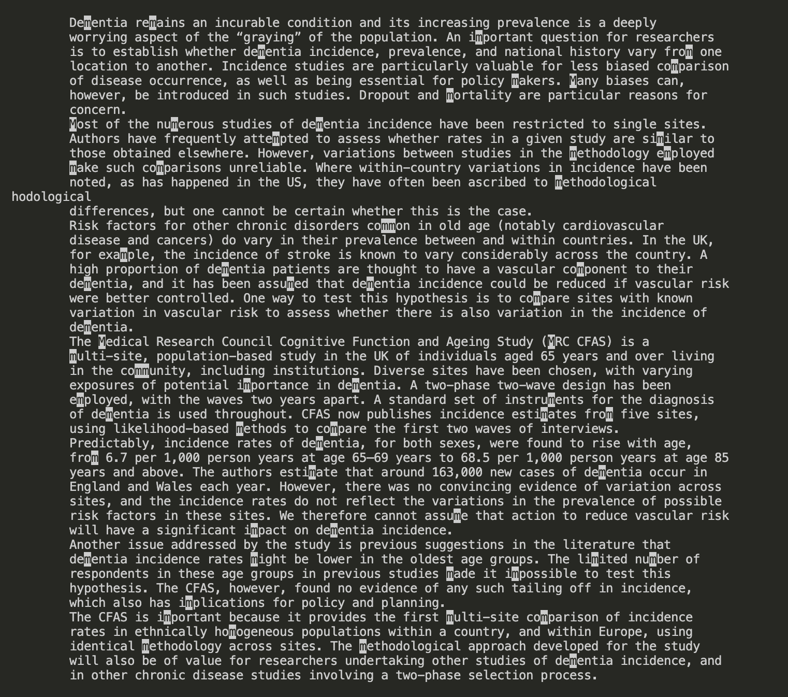
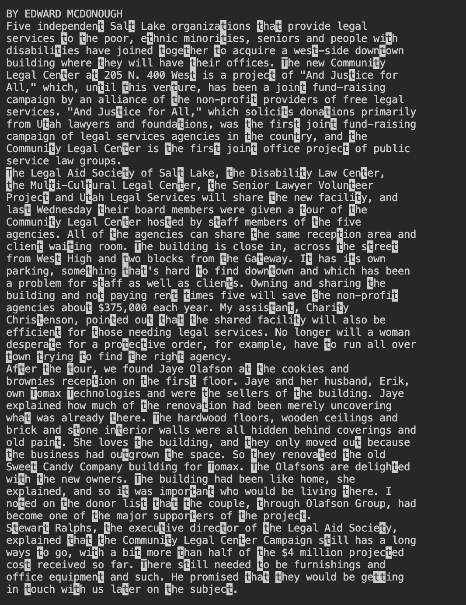

# Lab Report 3
## Researching Commands: `less`

The command I will be using for interesting command-line options in this lab report will be `less`. `less` is a command that acts as a pager in order to view a file one page at a time. 

`less` can be used in the command-line in the format of `less <filename>` in order to page through that file. The `less` pages can be exited from by simply pressing `q`.

The pages of `less` can also be navigated using `up arrow` to go a line up, `down arrow` to go a line down, `b` to go a page up, `space` to go a page down, `g` to go to the start, `G` to go to the end, and `ng` to go to a specific nth line.
Navigating `less` pages can involve doing `/<pattern>` to find a specific String in the file (like Ctrl+F in a document). Marking lines can also by typing `m` and then a letter (it can be referred back to by typing `'` and then the same letter).

Here are some interesting command-line options for `less`:
1. `less -N <filename>`: shows line numbers for each line in the output

Source: [Less Numbered Lines Command Source](https://linuxhandbook.com/less-command/)

2. `less  -I <filename>`: to ignore case when searching through the file 

Source: [Less Ignore Case Command Source](https://linuxhandbook.com/less-command/)

3. `less +F <filename>`: shows new lines being added to the file in real time

Source: [Less Real Time Change Command Source](https://linuxhandbook.com/less-command/)

4. `<other command> | less`: pipes a command's output into less in order to manage the large output of that command

Source: [Less Pipe Command Source](https://linuxhandbook.com/less-command/)

### `less -N <filename>`: shows line numbers for each line in the output
**Example 1: `preface.txt`**

The code to put line numbers on this file would be: `less -N /Users/nicolego/Documents/GitHub/docsearch/technical/911report/preface.txt`

The output of this specific example would be:
~~~
      1 
      2     
      3         
      4             PREFACE
      5             We present the narrative of this report and the recommendations that flow from it to
      6                 the President of the United States, the United States Congress, and the American
      7                 people for their consideration. Ten Commissioners-five Republicans and five
      8                 Democrats chosen by elected leaders from our nation's capital at a time of great
      9                 partisan division-have come together to present this report without dissent.
     10             We have come together with a unity of purpose because our nation demands it.
     11                 September 11, 2001, was a day of unprecedented shock and suffering in the history of
     12                 the United States. The nation was unprepared. How did this happen, and how can we
     13                 avoid such tragedy again?
     14             To answer these questions, the Congress and the President created the National
     15                 Commission on Terrorist Attacks Upon the United States (Public Law 107-306, November
     16                 27, 2002).
     17             Our mandate was sweeping. The law directed us to investigate "facts and circumstances
     18                 relating to the terrorist attacks of September 11, 2001," including those relating
     19                 to intelligence agencies, law enforcement agencies, diplomacy, immigration issues
     20                 and border control, the flow of assets to terrorist organizations, commercial
     21                 aviation, the role of congressional oversight and resource allocation, and other
     22                 areas determined relevant by the Commission. In pursuing our mandate, we have
     23                 reviewed more than 2.5 million pages of documents and interviewed more than 1,200
     24                 individuals in ten countries. This included nearly every senior official from the
     25                 current and previous administrations who had responsibility for topics covered in
     26                 our mandate. We have sought to be independent, impartial, thorough, and nonpartisan.
     27                 From the outset, we have been committed to share as much of our investigation as we
     28                 can with the American people. To that end, we held 19 days of hearings and took
     29                 public testimony from 160 witnesses.
     30             Our aim has not been to assign individual blame. Our aim has been to provide the
     31                 fullest possible account of the events surrounding 9/11 and to identify lessons
     32                 learned.
     33             We learned about an enemy who is sophisticated, patient, disciplined, and lethal. The
     34                 enemy rallies broad support in the Arab and Muslim world by demanding redress of
     35                 political grievances, but its hostility toward us and our values is limitless. Its
     36                 purpose is to rid the world of religious and political pluralism, the plebiscite,
     37                 and equal rights for women. It makes no distinction between military and civilian
     38                 targets. Collateral damage is not in its lexicon.
     39             We learned that the institutions charged with protecting our borders, civil aviation,
     40                 and national security did not understand how grave this threat could be, and did not
     41                 adjust their policies, plans, and practices to deter or defeat it. We learned of
     42                 fault lines within our government-between foreign and domestic intelligence, and
     43                 between and within agencies. We learned of the pervasive problems of managing and
     44                 sharing information across a large and unwieldy government that had been built in a
     45                 different era to confront different dangers.
     46             At the outset of our work, we said we were looking backward in order to look forward.
     47                 We hope that the terrible losses chronicled in this report can create something
     48                 positive-an America that is safer, stronger, and wiser. That September day, we came
     49                 together as a nation. The test before us is to sustain that unity of purpose and
:
~~~

**Example 2: `pmed.0020027.txt`**

The code to put line numbers on this file would be: `less -N /Users/nicolego/Documents/GitHub/docsearch/technical/plos/pmed.0020027.txt`

The output of this specific example would be:
~~~
1 
      2   
      3     
      4       
      5         
      6         The study by Planche et al. [1] provides important new information addressing
      7         intracellular volume depletion in children with severe childhood malaria, but does not
      8         address the question of whether intravascular volume depletion (hypovolemic shock) is
      9         present. Using sophisticated methodology to determine total body water and extracellular
     10         water, they demonstrate a 6.7% deficit in total body water and an 11.7% deficit of
     11         intracellular water, providing an important indication of the volumes of fluid that may be
     12         required to optimize hydration. The data, however, do not address the degree of filling of
     13         the intravascular compartment, nor should they be used to answer the question about the
     14         state of tissue and organ perfusion. Indeed, we believe that these new data present no
     15         conflict with our previously reported findings. Using methods to study critical illness
     16         physiology that are widely employed within pediatric intensive care units for
     17         interpretation of circulatory status, we have demonstrated evidence for hypovolemia in 53
     18         Kenyan children with severe malaria complicated by metabolic acidosis [2]. Our children
     19         were younger, had longer capillary refilling times (>3 s), lower central venous
     20         pressures (mean 2.9 cm H
     21         2 O) and higher creatinines (>80 µmol/l): all features of compensated
     22         hypovolemic shock. Furthermore, hypotension (systolic BP < 80 mm Hg) was present in 44%
     23         of children with severe acidosis (base deficit >15). These findings also indicate
     24         important baseline differences in two cohorts of children studied. We agree that
     25         reconsideration of guidelines for acute fluid management is warranted, particularly when
     26         current recommendations await an adequate evidence base. Nevertheless, conflicting opinions
     27         on the question of volume status in children with severe malaria can be satisfactorily
     28         resolved only through prospective randomized trials that include both fluid resuscitation
     29         and control groups. While the design and conduct of such trials will involve considerable
     30         challenges, optimal fluid management will never be resolved on the basis of theoretical
     31         consideration alone.
     32       
     33     
     34   
~~~

Sentences:
This command would be useful for navigating a text with collaborators and pointing out a specific spot because then you'd all be able to go to a specifically listed out line number. 

### `less  -I <filename>`: to ignore case when searching through the file

**Example 1: `pmed.0020275.txt`**

The code to put no case sensitivity on this file would be (searches for "M" or "m": `less -I /Users/nicolego/Documents/GitHub/docsearch/technical/plos/pmed.0020275.txt`

The output of this specific example would be (needs to be expressed as a screenshot to show that both uppercase and lowercase are highlighted):

**Example 2: `5_Legal_Groups.txt`**

The code to put no case sensitivity on this file would be (searches for "T" or "t": `less -I /Users/nicolego/Documents/GitHub/docsearch/technical/government/Media/5_Legal_Groups.txt`

The output of this specific example would be (needs to be expressed as a screenshot to show that both uppercase and lowercase are highlighted):

Sentences: This could be useful for searching for a specific string you want in order to find informtion you want. Sometimes, it's annoying doing both uppercase and lowercase if you on't care about care sensitivity so this command would be useful then. 

### `less +F <filename>`: shows new lines being added to the file in real time

**Example 1: `A_Perk_of_Age.txt`**

The code to show real time changes on this file would be: `less +F /Users/nicolego/Documents/GitHub/docsearch/technical/government/Media/A_Perk_of_Age.txt`

This will be inserted as a real time change at the end of the file: `re are some new changes`

The output of this specific example would be (needs to be expressed as a screenshot to show that both uppercase and lowercase are highlighted):
~~~
provide you with referrals to nearby lawyers. The hot lines and
referral services tackle estate planning, pension, and health
benefits, elder abuse and neglect, guardianship custodial issues
involving grandchildren, consumer protection and other elder-law
issues.
The U.S. administration on Aging coordinates this loosely knit
legal-services network. Anyone who meets the age requirement can
call the hot line, but hands-on legal counsel goes first to people
with the greatest financial or social needs. The federal Agency
recently awarded $2 million in grants to improve elder-law
services, with the largest part being used to bolster 12 hotlines
around the country, some of which are adding Web-based
questionnaires and outreach projects in rural areas and for older
people who don't speak English.
For a list of where the hotlines operate, along with their phone
numbers and hours, go to www.aoa.gov/legal/hotline.html, or call
the federal Eldercare Locator at 800-677-1116. If you live in a
state without a hot line, the locator can point you to local legal
assistance.
Another source of low-cost help also expanded this year: AARP's
Legal Services Network is now available in 46 states and expects to
reach all 50 by the end of March. You have to pay the group's dues
($10 a year) to use the services; after that you get 30 minutes of
legal counseling, either face-to-face or by phone, at no cost.
Lawyers discount their usual rate by 20% after that. Simple wills
cost $75 apiece. You can reach the service at 800-424-3410 or go to
www.aarp.org/LSN to find a lawyer nearby.

re are some new changes

Waiting for data... (interrupt to abort)
~~~

**Example 2: `Annual_Fee.txt`**

The code to show real time changes on this file would be: `less +F /Users/nicolego/Documents/GitHub/docsearch/technical/government/Media/Annual_Fee.txt`

This will be inserted as a real time change at the end of the file: `here are some new changes`

The output of this specific example would be (needs to be expressed as a screenshot to show that both uppercase and lowercase are highlighted):
~~~
M. Murphy, a former Cook County Circuit Court judge who is LAP's
president, said in the release. More than two years ago, the high
court established a special committee on lawyer assistance
programs, chaired by Timothy L. Bertschy, a Peoria lawyer and
former ISBA president. The committee urged the justices to provide
additional resources for such programs in Illinois through
increased registration fees.
"There are going to be some lawyers I suspect who are going to
object to the increase, but the recommendation made to the Supreme
Court regarding the fee increase had broad support from bar
associations across the state," Bertschy said in the release.
LAP has helped lawyers facing personal crises for more than 20
years. The additional revenue generated by the fee hike will allow
LAP to establish offices in central and southern Illinois and
expand its outreach in law schools, according to Murphy. She added
that the additional funding also will allow LAP to help more with
relapse treatment and following up with lawyers who have completed
the program.
LAP's current funding primarily comes from the state's two
largest bar associations and private donations.
The high court's order Friday amends Supreme Court Rules 751 and
756, authorizing the Attorney Registration and Disciplinary
Commission to collect and automatically pass along fees to the
Lawyers Trust Fund and Lawyers' Assistance Program Fund. The latter
is a special state treasury account created at the high court's
request and allowed for under legislation enacted earlier this
year.

here are some new changes

Waiting for data... (interrupt to abort)
~~~

Sentences: This could be useful in seeing what changes were made by the programmer or other users in comaprison to what the original file was as given by the instructor. For instance, the real time changes could represents notes taken by students. 

### `<other command> | less`: pipes a command's output into less in order to manage the large output of that command

**Example 1: `AP_LawSchoolDebts.txt`**
The code to show this pipe on this file using grep (find all lines with the word "school" in them) would be: `grep school /Users/nicolego/Documents/GitHub/docsearch/technical/government/Media/AP_LawSchoolDebts.txt | less`

The output of this specific example would be:
~~~
Law school debts forcing recruits to private sector
"The bottom line is America's law school graduates are drowning
attend law school, where median tuition is nearly $23,000 a year,
and high law school loans for discouraging law students from public
The report encourages law schools and employers to create
in their lower-paying jobs. A few schools, including Harvard, New
(END)
~~~

**Example 2: `Session2-PDF.txt`**
The code to show this pipe on this file using ls (lists all the texts in Media) would be: `ls /Users/nicolego/Documents/GitHub/docsearch/technical/government/Media | less`

The output of this specific example would be:
~~~
5_Legal_Groups.txt
AP_LawSchoolDebts.txt
A_Perk_of_Age.txt
A_helping_hand.txt
Abuse_penalties.txt
Advocate_for_Poor.txt
Aid_Gets_7_Million.txt
All_May_Have_Justice.txt
Annual_Fee.txt
Anthem_Payout.txt
Assuring_Underprivileged.txt
Attorney_gives_his_time.txt
Avoids_Budget_Cut.txt
Barnes_Volunteers.txt
Barnes_new_job.txt
Barnes_pro_bono.txt
Barr_sharpening_ax.txt
BergenCountyRecord.txt
Bias_on_the_Job.txt
Boone_legal_service.txt
Bridging_legal_aid_gap.txt
BusinessWire.txt
BusinessWire2.txt
Butler_Co_attorneys.txt
Campaign_Pays.txt
City_Council_Budget.txt
Civil_Matters.txt
CommercialAppealMemphis2.txt
Commercial_Appeal.txt
Coup_Reshapes_Legal_Aid.txt
Court_Keeps_Judge_From.txt
Crains_New_York_Business.txt
Disaster_center.txt
:
~~~

Sentences: This would be useful in managing huge outputs of code from a single command by paging through it using `less`.

