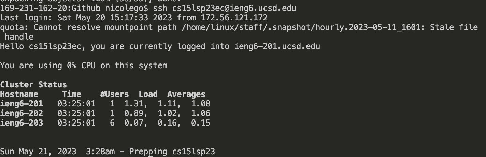
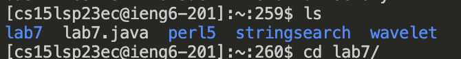
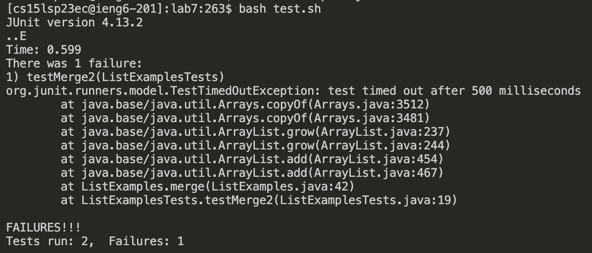
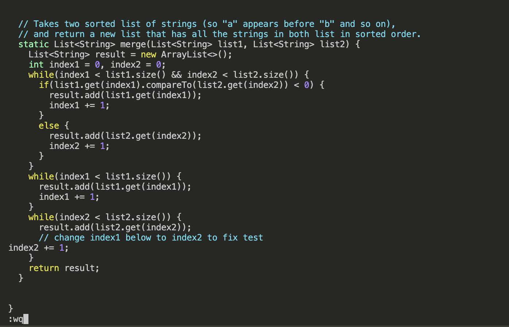
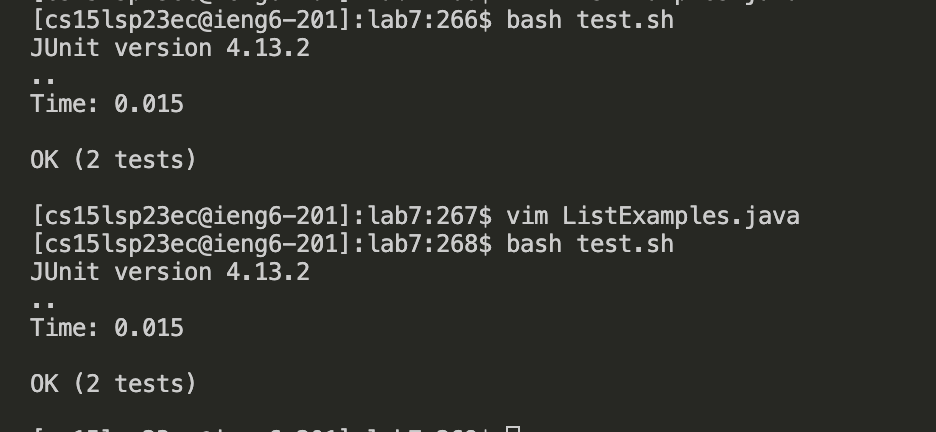
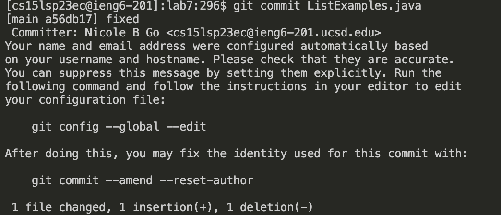
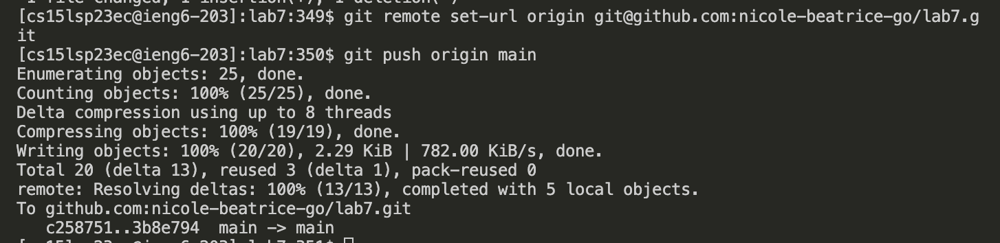

# Lab Report 4
## Vim: Doing it All From the Command Line

### Log into ieng6

1. `<Ctrl>`,`c` the `ssh` command for my ieng6 account from Notes App
2. `<Ctrl>`,`v` into terminal: copy and pastes `ssh cs15lsp23ec@ieng6.ucsd.edu` into terminal
3. `<enter>`: runs command to log into ieng6 account

### Clone your fork of the repository from your Github account

1. `<Ctrl>`,`c` the `git clone` command from Lab 7 instructions
2. `<Ctrl>`,`v` into terminal: copy and pastes `git clone https://github.com/ucsd-cse15l-s23/lab7`
3. `<enter>`: runs command to clone lab7 repository

### Run the tests, demonstrating that they fail

1. `l`, `s`, `<enter>`: lists out components of student account
2. `c`, `d`, `l`, `<tab>`, `<enter>`: changes directory to go into lab7
3. `b`, `a`, `s`, `h`, `t`, `<tab>`, `<enter>`: runs `bash test.sh` to run test of `ListExamples.java`

### Edit the code file to fix the failing test

1. `v`, `i`, `m`, `<Shift>`, `l`, `<tab>`, `.`, `j`, `a`, `v`, `a`, `<enter>`: opens `ListExamples.java` on `vim`
2. `/`, `i`, `n`, `d`, `e`, `x`, `1`, `<enter>`: finds all instances of `index1` on `ListsExamples.java`
3. `n`,`n`,`n`,`n`,`n`,`n`,`n`,`n`,`n`: goes to the last instance of `index1` that needs to be changes
4. `e`: goes to the end of the word `index1`
5. `x`: deletes the `1` in `index1`
6. `i`: goes into `insert` mode
7. `2`: puts a `2` at the end of the `index`
8. `<esc>`: exits `insert` mode
9. `:`, `w`, `q`,`<enter>`: saves edits and quits `vim`

### Run the tests, demonstrating that they now succeed

1. `<up>`, `<up>`, `<up>`, `<enter>`: goes to command in history `bash test.sh` to show tests again

### Commit and push the resulting change to your Github account (you can pick any commit message!)

2. `g`,`i`,`t`,`<space>`, `c`,`o`,`m`,`m`,`i`,`t`, `<space>`,`<tab>`,`<enter>`: commits `ListExamples.java` (the only file that has changes to commit)
3. `i`: goes into "insert" mode to put in commit message
4. `f`,`i`,`x`,`e`,`d`: inserts commit message "fixed"
5. `<esc>`: exits "insert" mode
6. `:`,`w`,`q`,`<enter>`: saves and quits commit message
7. `<Ctrl>`,`c` the SSH URL of my forked repository of lab7: copies the SSH URL of my repository needed to push, which is `git@github.com:nicole-beatrice-go/lab7.git`
8. `g`,`i`,`t`,`<space>`, `r`,`e`,`m`,`o`,`t`,`e`, `s`,`e`,`t`,`-`,`u`,`r`,`l`,`<space>`,`o`,`r`,`i`,`g`,`i`,`n`, `<space>`, `<Ctrl>`,`v`,`<enter>`: pastes and runs command to set origin to SSH URL of lab 7 repository 
9. `g`,`i`,`t`,`<space>`,`p`,`u`,`s`,`h`,`<space>`,`o`,`r`,`i`,`g`,`i`,`n`,`<space>`,`m`,`a`,`i`,`n`: pushes changes that were committed to `ListExamples.java` to the main branch 
