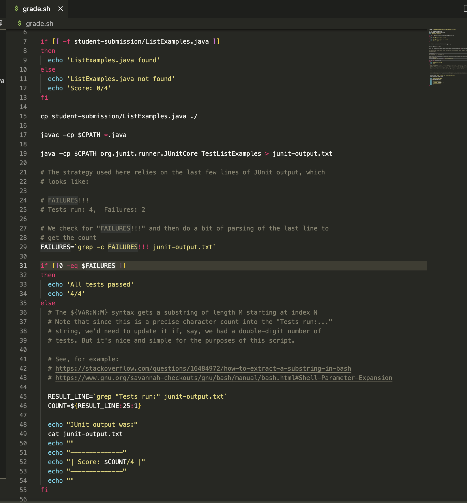
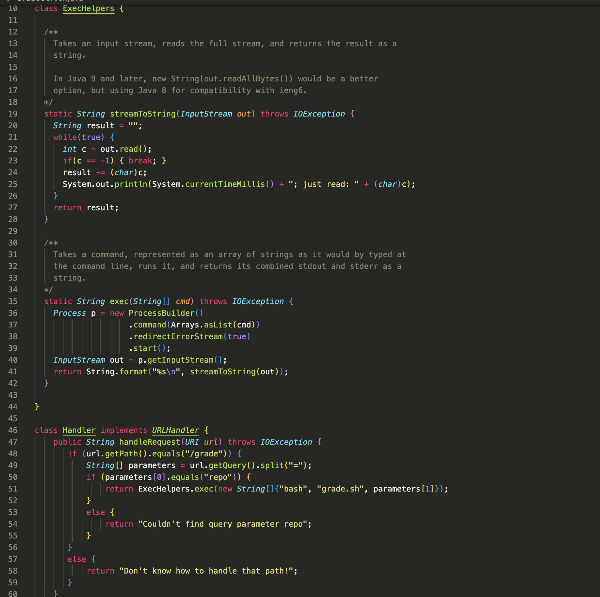
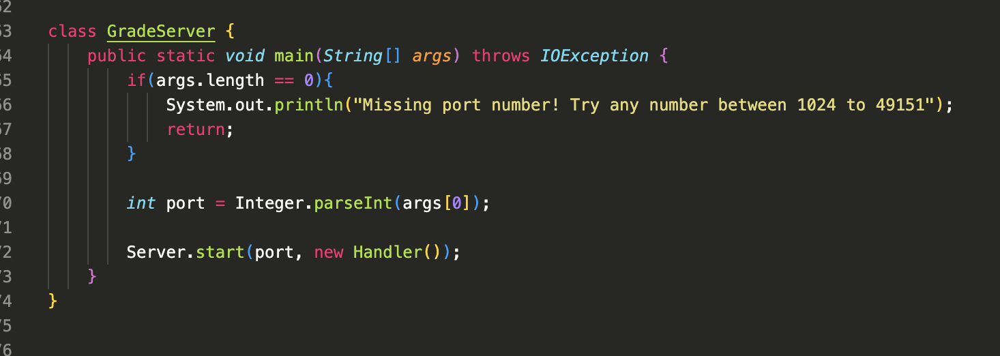
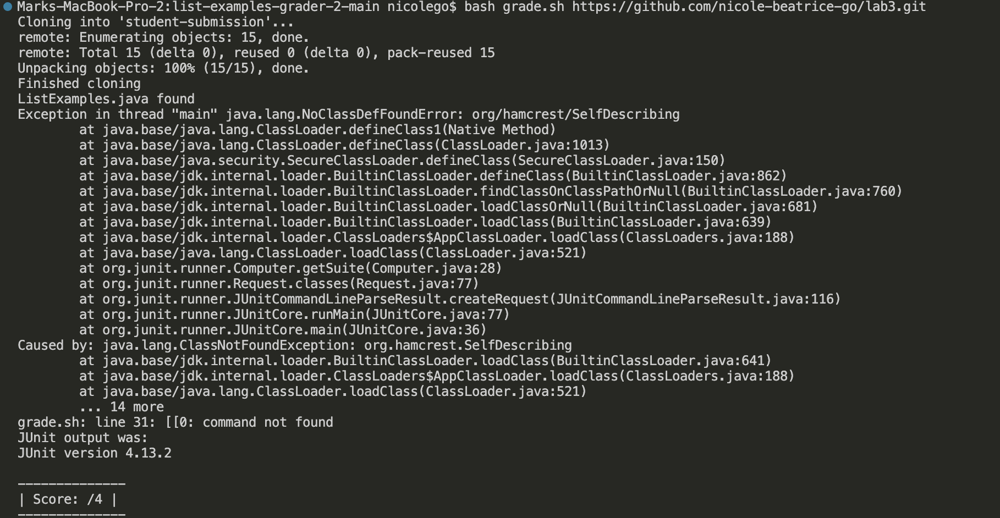
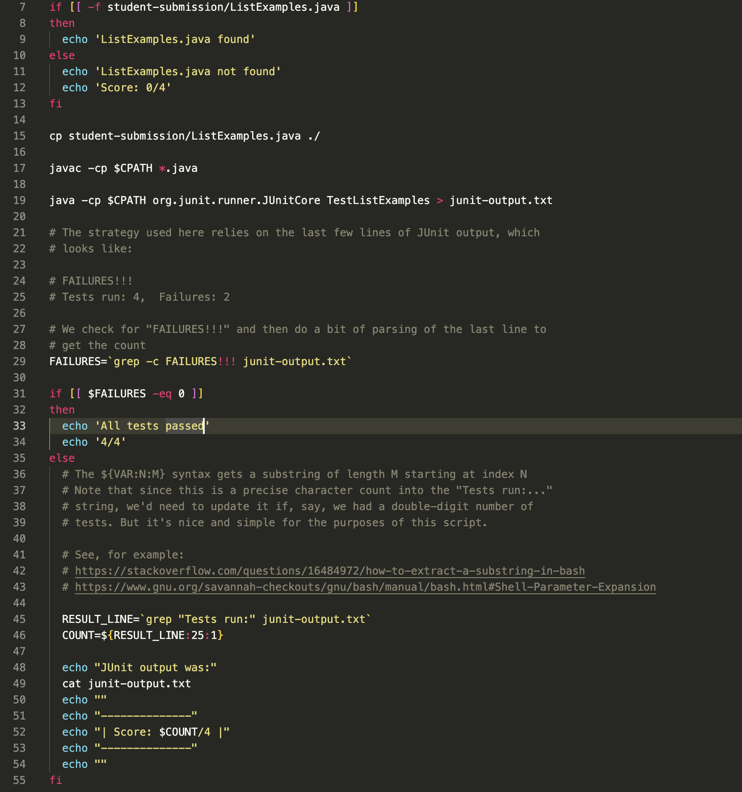
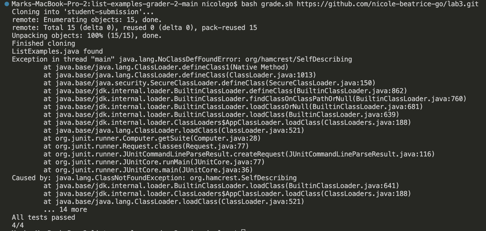

# Lab Report 5: Debbugging and Reflection
---
## Part 1: Debugging 

### EdStem Post
Hello! I was coding or Week 6's lab for the autograder and I keep running into this error for `grade.sh` when I run `bash grade.sh` in the terminal. I was wondering if I could get some help on how to resolve this.

**What environment are you using (computer, operating system, web browser, terminal/editor, and so on)?**
I'm using my own laptop (Macbook) as my computer, MacOS as my operating system, Google Chrome as my web browser, and VS Code as my code editor.

**Detail the symptom you're seeing. Be specific; include both what you're seeing and what you expected to see instead. Screenshots are great, copy-pasted terminal output is also great. Avoid saying “it doesn't work”.**
Here are screenshots of my bash code on `grade.sh`, my java code on `GradeServer.java`, and my terminal output in that order.

I see that the command I have isn't found on line 31 `if [[0 -eq $FAILURES ]]`, which is supposed to check if there's 0 failures and then tell them that all their tests passed if that's the case. The score is also not printed and is blank as`Score /4` I expected to not see an error for a command not being found and for it to print a score. 

**Detail the failure-inducing input and context. That might mean any or all of the command you're running, a test case, command-line arguments, working directory, even the last few commands you ran. Do your best to provide as much context as you can.**
I'm running `grade.sh` with an example file I had from lab3 `ListExamples.java`, which would be `bash grade.sh https://github.com/nicole-beatrice-go/lab3.git`. I didn't run any commands beforehand am in working directory of the repository `/Users/nicolego/Downloads/list-examples-grader-2-main`. 

What am I doing wrong? Thank you so much!

### TA's Response
Hey Nicole! It seems like you have a formatting and logistical error with the command you wrote on line 31. Think about what the format of `-eq` is supposed to be because you are supposed to put the number after the `-eq` and the variable before the `-eq` in order to check if the variable is equal to that number. Also, remember that in bash scripts, there are supposed to be spaces between the command and the double brackets. Let me know how it goes and good luck!

### Student's Attempt at TA's Feedback
Hello and thank you so much! I tried out you feedback and it worked out! I learned that I misformatted the `-eq` command as the bug was it was supposed to be `if [[ $FAILURES -eq 0 ]]` with the variable `$FAILURES` before the `-eq` and the number `0` after the `-eq` and spaces between the double brackets and the command. Here's a screenshot of the successful run of the fixed code and the fixed bash code itself!

Thank you again!

### Setup and Bug Information
Here is the information about my setup. 
- My current working directory is the repository `/Users/nicolego/Downloads/list-examples-grader-2-main` and the files on it are a bash script `grade.sh` and the Java files `Server.java`, `GradeServer.java`, and `testListExamples.java`. I am using an example file to grade from lab 3 `ListExamples.java` as the argument to run `grade.sh` on the command line and grade that file. `grade.sh` is used to grade the file by the standards of passing the tests in `testListExamples.java`. `GradeServer.java` sets up a server using `Server.java` that grades based on the command changing in the URL in order to run `grade.sh`. The file with the bug is `grade.sh`.
- Here are the contents of `grade.sh` before the bug is fixed:

- The command that was run to trigger the bug was `bash grade.sh https://github.com/nicole-beatrice-go/lab3.git`. 
- I needed to change line 31 from `if [[0 -eq 0 $FAILURES ]]`to `if [[ $FAILURES -eq 0 ]]` in order to fix the bug. I made it so that there were spaces between the double brackets and the command and so that the variable `$FAILURES` was before the `-eq` and the number `0` was after the `-eq`.

---
## Part 2: Reflection
In the second half of the quarter, I learned quite a lot whether it was directly from lab or something I learned along the way, especially because of our really helpful and cool tutors. This includes creating my own autograder in a bash script, using `vim` to edit files from the command line, cloning repositories from the command line, making SSH keys for `ieng6` and Github so that I no longer have to use my password when logging in and can use the SSH URLs, how to improve our implementations and give or receive peer feedback, how code can act differently on different machines, and how to use a Debugger. I also learned a couple of tips along the way in lecture or from our tutors like how to be faster on the command line using shortcuts or useful `vim` commands or how to use `assertEquals()` for `JUnit` with other data types. The concept that I'm especially enthusiatic about is the Debugger because I'm bad at debugging and I think knowing the variable values at a certain time could be especialy helpful and way more conveinent than print statements. 
